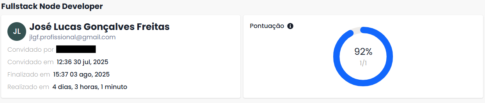

# 📚 Fullstack Dictionary

A personal dictionary where users can search words, mark them as favorites and view history.

You can access the project running on production here: <a href="https://fullstack-dictionary-kappa.vercel.app/">Fullstack dictionary</a>

## Result



## 🚀 Technologies Used

- **Frontend**
  - React (VITE)
  - React Router DOM
  - Axios
  - CSS3 / Responsive Design

- **Backend**
  - Node.js
  - Express.js
  - Mongoose (MongoDB)
  - JWT (Authentication)
  - Dotenv

- **Database**
  - MongoDB (MongoDB Atlas)

## ⚙️ How to Install and Run the Project

### 1. Clone the Repository

```bash
git clone https://github.com/JoseLucasapp/fullstack-dictionary
cd fullstack-dictionary
```

### 2. Backend

```bash
cd backend
npm install
```

Create a `.env` file inside `backend/` with the following variables:

```env
PORT=5000
MONGO_URI=your_mongo_connection_string
JWT_SECRET=your_secret_key
WORD_API_URL=https://api.dictionaryapi.dev/api/v2/entries/en/
```

Start the backend server:

```bash
npm run dev
```

### 3. Frontend

```bash
cd frontend
npm install
```

Create a `.env` file inside `frontend/` with the following variable:

```env
VITE_API_URL=http://localhost:5000
```

Start the frontend:

```bash
npm run dev
```

The app will be available at `http://localhost:5173/`

---

## 📌 Features

- User registration and login
- Search words with definitions
- Word search history
- Mark words as favorites
- Responsive for mobile

---

## 📄 License

This project is under the MIT license. See the `LICENSE` file for more details.
